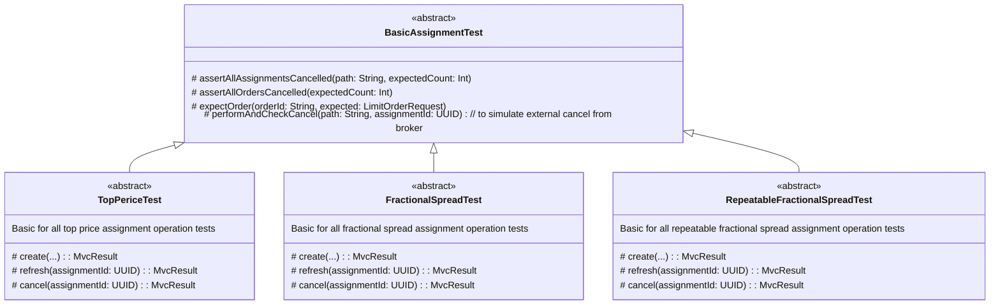

See [assignment doc](/doc/assignments/overview.md) to get context of what assignment is.

## Test cases

Tests must cover

- All types of assignment
- All actions of each assignment

So it is Cartesian product of all types of assignment and all actions of each assignment:

| Assignment                | create | refresh | cancel | ... |
|---------------------------|--------|---------|--------|-----|
| TopPriceAssignment        | cases  | cases   | cases  | ... |
| FractionalPriceAssignment | cases  | cases   | cases  | ... |
| ...                       | ...    | ...     | ...    | ... |

Every case must chek minimal peace of functionality, but not simultaneously batch of them.

## Integration

Means that all app is tested except external services. External services are covered with adapters that encapsulate
interaction with them. Adapters are mocked, other Spring components are not. Adapters and axillary mock methods are
[located here](/src/test/kotlin/ru/pashkovske/buratino/integration/mock)

Use only MvcMock to call tested functionality, never calls it directly.

Do not use:

- `org.mockito.kotlin.whenever`; `org.mockito.Mockito.`when``
- `MockitoSpyBean`
- `org.mockito.Mockito.verify`; `org.mockito.Mockito.never`

etc.

Instead use

- `org.springframework.test.web.servlet`
- Calls to a database
- `@Autowired` + production `@Bean` methods. Only if it cannot be covered by mvc mock

Tests use local database.

## Structure

Test are inherited
from [BasicAssignmentTest](/src/test/kotlin/ru/pashkovske/buratino/integration/assignment/BasicAssignmentTest.kt).
Package structure copies assignment classes structure.

Every action in assignment is tested in a separate class.

If common auxiliary testing method is needed, it can be placed in common abstract test class.

