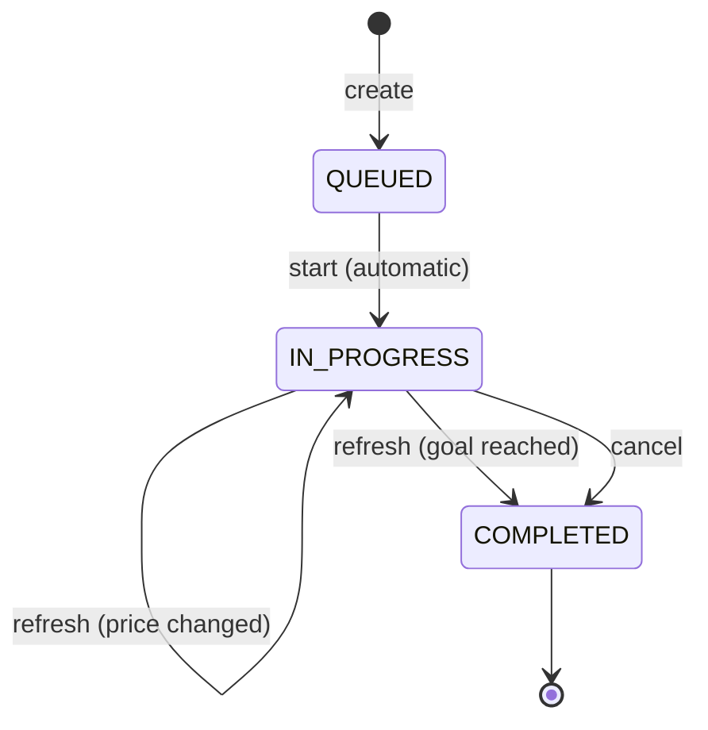

# Assignments — overview

An **assignment** is a trading strategy that Buratino runs on your behalf over a single [instrument](../instruments.md).
You describe the high-level goal once ("sell one lot at the best book price", "buy one lot only if a 0.1% spread
holds", "do that in a loop, flipping direction on every fill"), and Buratino takes care of placing, updating and
cancelling the broker [orders](../orders.md) that pursue that goal.

This page is the entry point to the assignment concept. Each concrete strategy has its own page:

- [Top Price](top-price.md)
- [Fractional Spread](fractional-spread.md)
- [Repeatable Fractional Spread](repeatable-fractional-spread.md)

## Lifecycle

Every assignment goes through a small state machine:

| State         | Meaning                                                                                                                            |
|---------------|------------------------------------------------------------------------------------------------------------------------------------|
| `QUEUED`      | Created but not yet started. This is a transient state — the application starts the assignment automatically right after creation. |
| `IN_PROGRESS` | The assignment is actively managing a broker order. This is where it spends most of its life.                                      |
| `COMPLETED`   | Terminal state. The assignment is immutable: it cannot be refreshed, cancelled or restarted. Its history is kept for inspection.   |

An assignment reaches `COMPLETED` in one of two ways:

1. Its strategy's goal is reached — typically the underlying broker order is fully executed.
2. It is explicitly cancelled.

## Common operations

Every strategy exposes the same set of operations. Replace `{strategy}` below with `top-price`, `fractional-spread`, or
`repeatable/fractional-spread`.

| Operation   | HTTP     | Path                                                      | Description                                                 |
|-------------|----------|-----------------------------------------------------------|-------------------------------------------------------------|
| Start       | `POST`   | `/assignment/{strategy}/{instrumentId}/start/{direction}` | Create and start an assignment. Body is strategy-specific.  |
| List        | `GET`    | `/assignment/{strategy}/`                                 | List all assignments of this strategy.                      |
| Get one     | `GET`    | `/assignment/{strategy}/{id}`                             | Fetch a single assignment by UUID.                          |
| Refresh     | `PATCH`  | `/assignment/{strategy}/{id}/refresh`                     | Manually reconcile this assignment with the current market. |
| Refresh all | `PATCH`  | `/assignment/{strategy}/refresh-all`                      | Reconcile every `IN_PROGRESS` assignment of this strategy.  |
| Cancel      | `DELETE` | `/assignment/{strategy}/{id}`                             | Cancel the assignment (terminal).                           |

### What `start` does

Creates the assignment from your parameters, marks it `QUEUED`, then immediately starts it — which sets up the
broker-side artifacts: it places the initial limit order, registers an [auto-refresh notifier](../auto-refresh.md) if
you asked for one, etc. After this, the assignment is `IN_PROGRESS`.

### What `refresh` does

Reconciles the assignment with the current market state according to the strategy:

- If the strategy's goal has been reached (the underlying order is fully executed), the assignment is moved to
  `COMPLETED`.
- Otherwise, the strategy recomputes the desired price from the live order book and updates the broker order if it has
  changed. The assignment remains `IN_PROGRESS`.

You can trigger refresh manually (`PATCH .../{id}/refresh`), refresh everything in bulk (`PATCH .../refresh-all`), or
schedule it automatically (see [Auto-refresh](../auto-refresh.md)).

### What `cancel` does

Terminates the assignment. Cancels all its broker-side artifacts — the active broker order, the auto-refresh notifier —
and moves the assignment to `COMPLETED`. Once cancelled, an assignment cannot be modified or restarted.

## Response shape

Every assignment endpoint that returns an assignment includes at least these fields:

| Field             | Meaning                                                                                                                |
|-------------------|------------------------------------------------------------------------------------------------------------------------|
| `id`              | UUID assigned by Buratino. Use it in all subsequent endpoint calls.                                                    |
| `iid`             | `instrumentId` the assignment operates on.                                                                             |
| `state`           | One of `QUEUED`, `IN_PROGRESS`, `COMPLETED`.                                                                           |
| `refreshNotifier` | `null` if you didn't request auto-refresh. Otherwise the notifier descriptor (see [Auto-refresh](../auto-refresh.md)). |

Plus strategy-specific fields (`direction`, `info.orderId`, `oneStepOver`, `rate`, `child`, …) documented in each
strategy's page.

## Auto-refresh

If you pass `refreshNotifyPeriod` (an ISO-8601 duration like `PT10M`) in the start body, Buratino will refresh the
assignment automatically at that interval. The notifier becomes `ACTIVE` while the assignment is `IN_PROGRESS` and
`COMPLETED` when the assignment is cancelled or completes. Only `PERIODIC` notifiers exist today. Active notifiers
survive an application restart. Full details: [Auto-refresh](../auto-refresh.md).

## Persistence

Assignments, their parameters, state, history, and active auto-refresh schedules are persisted. After an application
restart, every `IN_PROGRESS` assignment continues to operate and its auto-refresh resumes without any user action.
`COMPLETED` assignments remain in the history but are not "revived".

## Glossary

- **Order** — a single request to the broker (buy/sell, quantity, price). See [Orders](../orders.md).
- **Limit order** — an order with a target price; executes only at that price or better. All Buratino strategies place
  limit orders.
- **Order book** — the live list of currently outstanding BUY and SELL offers on the broker for a given instrument.
  Buratino strategies read this book to decide what price to quote.
- **Price step** (`minPriceIncrement`) — smallest price change allowed by the broker for an instrument. Used by the
  `oneStepOver` option.
- **Lot** — the broker's quantity unit. Buratino assignments always operate on **1 lot**.
- **Spread** — the gap between the Best Buy and the best SELL price in the order book.
  The [Fractional Spread](fractional-spread.md) strategy quotes only when this gap is at least the configured `rate`
  fraction of the opposite-side price.
- **Direction** — `BUY` or `SELL`. Passed as `buy` / `sell` in the URL when starting an assignment.
