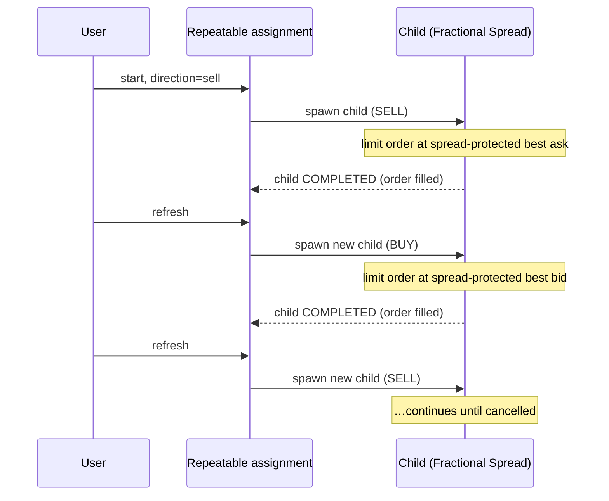

# Repeatable Fractional Spread strategy

> **Goal:** run an endless cycle of [Fractional Spread](fractional-spread.md) assignments, flipping direction after each
> fill, to accumulate spread profit over time.

This strategy is a wrapper around Fractional Spread. It maintains exactly one **child** Fractional Spread assignment at
a time. Whenever the child completes (i.e. its broker order is fully executed), the next `refresh` of the parent spawns
a new child with the **opposite** direction. The cycle continues until you cancel the parent.

## How the cycle works



The `direction` you pass on `start` is the **initial** direction. After each fill the next child flips to the opposite
side.

## Parameters

Identical to [Fractional Spread](fractional-spread.md).

| Where | Name                  | Type               | Required | Description                                                                                    |
|-------|-----------------------|--------------------|----------|------------------------------------------------------------------------------------------------|
| Path  | `instrumentId`        | string             | yes      | Broker UID of the instrument. Get it from [`GET /instrument/any/{ticker}`](../instruments.md). |
| Path  | `direction`           | enum               | yes      | `buy` or `sell` — the **initial** direction of the first child.                                |
| Body  | `rate`                | number in `(0, 1)` | **yes**  | Required spread fraction passed to each child, e.g. `0.001` for 0.1%.                          |
| Body  | `refreshNotifyPeriod` | ISO-8601 duration  | no       | If present, enables [auto-refresh](../auto-refresh.md) on the **parent** at that interval.     |

> The auto-refresh notifier you configure here drives the **parent**. Each parent refresh either refreshes the current
> child or spawns the next one if the child has just completed. You don't separately schedule notifiers on children.

## Behaviour

| Operation | Effect                                                                                                                                                                                                                 |
|-----------|------------------------------------------------------------------------------------------------------------------------------------------------------------------------------------------------------------------------|
| `start`   | Creates the parent assignment, spawns the initial child Fractional Spread assignment (which places its own broker order), and registers the parent's auto-refresh notifier if requested. Parent becomes `IN_PROGRESS`. |
| `refresh` | If the current child is `COMPLETED` → spawn a new child with the **opposite** direction. Otherwise → refresh the child (which may itself complete or update its broker order). The parent stays `IN_PROGRESS`.         |
| `cancel`  | Cancels the **current child** (which cancels its broker order). Completes the parent's auto-refresh notifier (if any). The parent moves to `COMPLETED`. Terminal — no further children are spawned.                    |

> The parent never reaches `COMPLETED` on its own; only `cancel` ends it.

## Endpoints

All endpoints require the `X-API-KEY` header.

| Operation   | Method   | Path                                                                        | Body                                                                                 |
|-------------|----------|-----------------------------------------------------------------------------|--------------------------------------------------------------------------------------|
| Start       | `POST`   | `/assignment/repeatable/fractional-spread/{instrumentId}/start/{direction}` | `{ "rate": 0.001, "refreshNotifyPeriod": "PT10M" }` (`refreshNotifyPeriod` optional) |
| List        | `GET`    | `/assignment/repeatable/fractional-spread/`                                 | —                                                                                    |
| Get one     | `GET`    | `/assignment/repeatable/fractional-spread/{id}`                             | —                                                                                    |
| Refresh     | `PATCH`  | `/assignment/repeatable/fractional-spread/{id}/refresh`                     | —                                                                                    |
| Refresh all | `PATCH`  | `/assignment/repeatable/fractional-spread/refresh-all`                      | —                                                                                    |
| Cancel      | `DELETE` | `/assignment/repeatable/fractional-spread/{id}`                             | —                                                                                    |

## Response fields

In addition to the common fields described in [the overview](overview.md) (`id`, `iid`, `state`, `refreshNotifier`):

| Field   | Meaning                                                                                                                                                                                                                                                                                                                                   |
|---------|-------------------------------------------------------------------------------------------------------------------------------------------------------------------------------------------------------------------------------------------------------------------------------------------------------------------------------------------|
| `child` | The **currently active inner Fractional Spread assignment** in full — same shape as the [Fractional Spread](fractional-spread.md) response. Its `direction` and `info.orderId` tell you which side and which broker order are currently working. When a child completes and a new one is spawned on the next refresh, this field updates. |

> To track the current broker order, look at `child.info.orderId`. To see whether the last cycle has just finished and a
> new child is about to be spawned, look at `child.state`.

## Examples

### Start a repeatable cycle starting with SELL, 0.2% spread, 10-minute auto-refresh

```bash
curl -X POST \
     -H "X-API-KEY: <your-key>" \
     -H "Content-Type: application/json" \
     -d '{
        "rate": 0.002,
         "refreshNotifyPeriod": "PT10M"
      }' \
     http://<host>/assignment/repeatable/fractional-spread/<instrumentId>/start/sell
```

Example response (truncated):

```json
{
  "id": "f5e9c40a-3e84-4f3c-9e1e-2d5b7d8a4f10",
  "iid": "<instrumentId>",
  "state": "IN_PROGRESS",
  "refreshNotifier": {
    "id": "…",
    "properties": {
      "type": "PERIODIC",
      "period": "PT10M"
    },
    "taskId": "…",
    "state": "ACTIVE"
  },
  "child": {
    "id": "…",
    "iid": "<instrumentId>",
    "state": "IN_PROGRESS",
    "direction": "SELL",
    "rate": 0.002,
    "info": {
      "orderId": "<broker-order-id>"
    },
    "refreshNotifier": null
  }
}
```

### Manually refresh (forces immediate child refresh / next-child spawn if applicable)

```bash
curl -X PATCH \
     -H "X-API-KEY: <your-key>" \
     http://<host>/assignment/repeatable/fractional-spread/<id>/refresh
```

### Refresh every in-progress Repeatable Fractional Spread assignment

```bash
curl -X PATCH \
     -H "X-API-KEY: <your-key>" \
     http://<host>/assignment/repeatable/fractional-spread/refresh-all
```

### Cancel the cycle

```bash
curl -X DELETE \
     -H "X-API-KEY: <your-key>" \
     http://<host>/assignment/repeatable/fractional-spread/<id>
```
