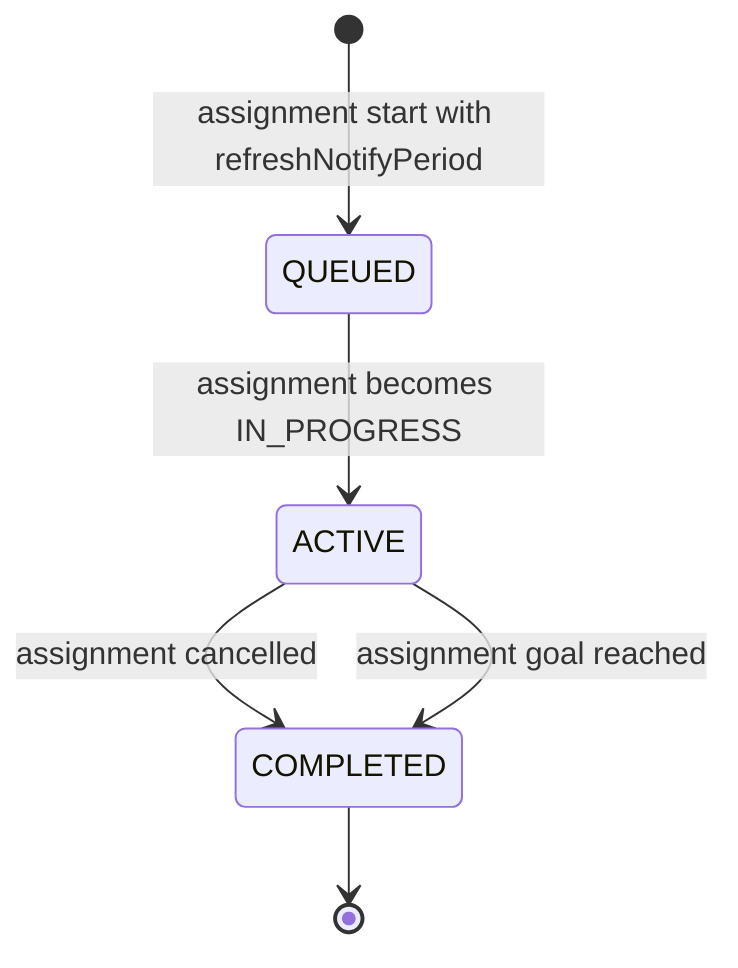

# Auto-refresh

Auto-refresh is mechanism for periodically reconciling an [assignment](assignments/overview.md) with the
current market on its own, without you having to call `PATCH .../refresh` by hand.

## How to enable it

Pass `refreshNotifyPeriod` in the body of the start endpoint, as an **ISO-8601 duration**:

```json
{
  "refreshNotifyPeriod": "PT10M"
}
```

If you omit `refreshNotifyPeriod` (or send an empty body `{}`), the assignment is created without auto-refresh and you
must drive `refresh` manually.

## Notifier states

| Notifier state | Meaning                                                                                                                            |
|----------------|------------------------------------------------------------------------------------------------------------------------------------|
| `QUEUED`       | The notifier has been created but is not yet firing periodic refreshes. This is a brief transient state during assignment startup. |
| `ACTIVE`       | The notifier is firing periodic refreshes. This is its state while the assignment is `IN_PROGRESS`.                                |
| `COMPLETED`    | The notifier has stopped firing. This happens when the assignment is cancelled or has reached its strategy goal. Terminal.         |

You can read the current state from `refreshNotifier.state` on any assignment endpoint that returns the assignment.

## What the notifier descriptor looks like

```json
{
  "refreshNotifier": {
    "id": "5b66f9ee-49e5-4c9d-9c8e-c1c9c5e6a5f1",
    "properties": {
      "type": "PERIODIC",
      "period": "PT10M"
    },
    "taskId": "…",
    "state": "ACTIVE"
  }
}
```

| Field               | Meaning                                                                   |
|---------------------|---------------------------------------------------------------------------|
| `id`                | Stable identifier of the notifier.                                        |
| `properties.type`   | Notifier kind. Only `PERIODIC` is exposed today.                          |
| `properties.period` | The ISO-8601 period you configured.                                       |
| `taskId`            | Identifier of the underlying scheduled task. Useful only for diagnostics. |
| `state`             | `QUEUED`, `ACTIVE`, or `COMPLETED` (see above).                           |

## Lifecycle



- When you create an assignment with `refreshNotifyPeriod`, the notifier is registered in `QUEUED` state and almost
  immediately flips to `ACTIVE` together with the assignment becoming `IN_PROGRESS`.
- While `ACTIVE`, the notifier triggers an internal `refresh` on the assignment at the configured period.
- When the assignment is `cancel`led or reaches its goal (e.g. the broker order is fully filled), the notifier
  transitions to `COMPLETED` and stops firing. It is not restarted.

> An assignment created without `refreshNotifyPeriod` simply has `refreshNotifier: null` in its responses; nothing
> periodic happens until you call `refresh` manually.

## Behavior on application restart

Auto-refresh schedules are **persistent**. When the application restarts:

- For every assignment that is `IN_PROGRESS` and has an `ACTIVE` refresh notifier attached, the notifier is **resumed
  automatically** with the same period it had before.
- Notifiers attached to assignments that are already `COMPLETED` are **not** resumed.

## Notifier types currently available

Only one notifier type is exposed today:

| Type       | Field                         | Description                     |
|------------|-------------------------------|---------------------------------|
| `PERIODIC` | `period: Duration` (ISO-8601) | Fires `refresh` every `period`. |

Future notifier types may be added; for now `PERIODIC` is the only option, and `refreshNotifyPeriod` in the start body
is the only way to enable it.
