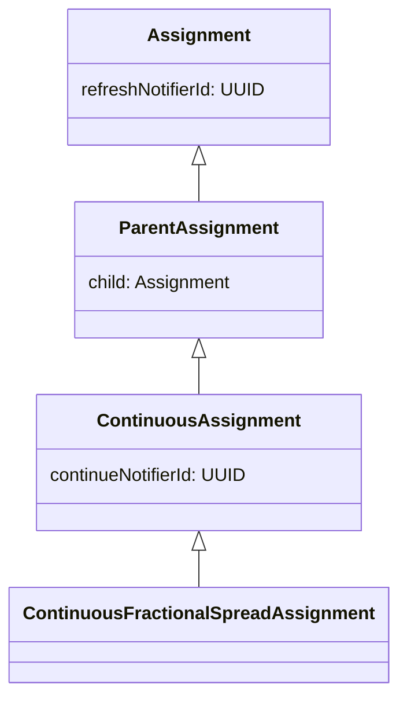
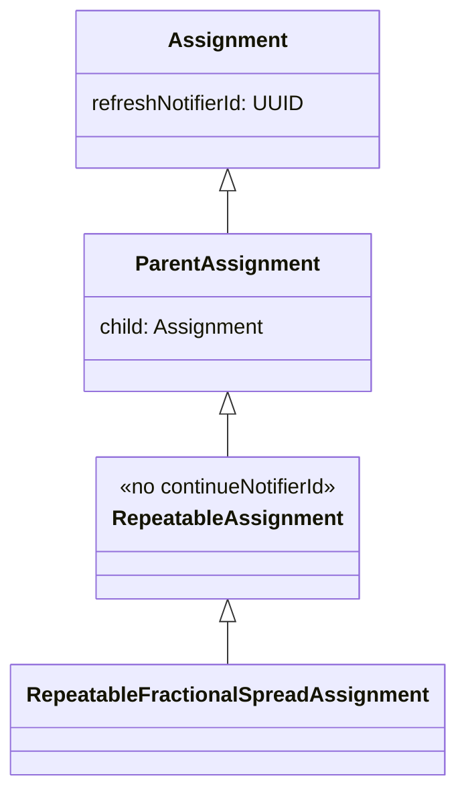

# Refactoring Plan: Remove `continue` operation, merge into `refresh`, rename `Continuous` → `Repeatable`

## Summary

Currently, `ContinuousAssignment` has two separate periodic operations:
- **`refresh`** — refreshes the child assignment (recalculates prices, replaces orders)
- **`continue`** — when the child is completed, creates a new child with the opposite direction

The goal is to **merge `continue` logic into `refresh`** so that `refresh` handles both:
1. If child is completed → create a new child with opposite direction (what `continue` used to do)
2. If child is not completed → refresh the child (existing behavior)

Then **remove all `continue`-related code** and **rename `Continuous` → `Repeatable`**.

## Current Architecture (Before)



Two separate notifiers schedule two separate periodic tasks:
- `RefreshNotifyOrchestrator` → calls `refresher.refresh()`
- `ContinueNotifyOrchestrator` → calls `continuer.continueAssignment()`

## Target Architecture (After)



Only one notifier: `RefreshNotifyOrchestrator` → calls `refresher.refresh()`, which now also handles the "continue" logic.

---

## Detailed Changes

### 1. Model Layer

#### 1.1 Rename `ContinuousAssignment` → `RepeatableAssignment`
- **File:** `model/core/ContinuousAssignment.kt` → `model/core/RepeatableAssignment.kt`
- **Changes:**
  - Rename class `ContinuousAssignment` → `RepeatableAssignment`
  - **Remove** `continueNotifierId` field and its `getContinueNotifierId()` / `initContinueNotifierId()` methods
  - The class becomes a thin pass-through to `ParentAssignment` (may even be collapsed, but keeping for extensibility)

#### 1.2 Rename `ContinuousFractionalSpreadAssignment` → `RepeatableFractionalSpreadAssignment`
- **File:** `model/core/ContinuousFractionalSpreadAssignment.kt` → `model/core/RepeatableFractionalSpreadAssignment.kt`
- **Changes:** Rename class, update parent to `RepeatableAssignment`

#### 1.3 Rename `ContinuousAssignmentStartCmd` → `RepeatableAssignmentStartCmd`
- **File:** `model/cmd/ContinuousAssignmentStartCmd.kt` → `model/cmd/RepeatableAssignmentStartCmd.kt`
- **Changes:**
  - Rename class
  - **Remove** `continueNotifierProperties` parameter

#### 1.4 Rename `ContinuousFractionalSpreadAssignmentStartCmd` → `RepeatableFractionalSpreadAssignmentStartCmd`
- **File:** `model/cmd/ContinuousFractionalSpreadAssignmentStartCmd.kt` → `model/cmd/RepeatableFractionalSpreadAssignmentStartCmd.kt`
- **Changes:**
  - Rename class
  - Remove `continueNotifierProperties` parameter from constructor

### 2. Service Layer — Refresh (the key behavioral change)

#### 2.1 Modify `ContinuousFractionalSpreadAssignmentRefresher` → `RepeatableFractionalSpreadAssignmentRefresher`
- **File:** `service/core/refresh/ContinuousFractionalSpreadAssignmentRefresher.kt` → `service/core/refresh/RepeatableFractionalSpreadAssignmentRefresher.kt`
- **Changes:**
  - Rename class
  - **Inject** `FractionalSpreadAssignmentBuilder` and `FractionalSpreadAssignmentStarter` (previously only in the continuer)
  - Change `doRefresh()` logic:
    - If child is completed → create new child with opposite direction (moved from `ContinuousFractionalSpreadAssignmentContinuer.doContinue()`)
    - If child is not completed → refresh child (existing behavior)

#### 2.2 Rename `ContinuousAssignmentRefresher` → `RepeatableAssignmentRefresher`
- **File:** `service/core/refresh/ContinuousAssignmentRefresher.kt` → `service/core/refresh/RepeatableAssignmentRefresher.kt`
- **Changes:** Rename class

### 3. Service Layer — Delete `continue` operation entirely

#### 3.1 Delete continuation service files
- **Delete:** `service/core/continuation/ContinuousAssignmentContinuer.kt`
- **Delete:** `service/core/continuation/BasicContinuousAssignmentContinuer.kt`
- **Delete:** `service/core/continuation/ContinuousFractionalSpreadAssignmentContinuer.kt`
- **Delete:** `service/core/continuation/dispatcher/ContinueDispatcher.kt`
- **Delete:** `service/core/continuation/dispatcher/ContinueDispatcherImpl.kt`
- **Delete entire directory:** `service/core/continuation/`

#### 3.2 Delete `ContinueNotifyOrchestrator`
- **Delete:** `service/notify/ContinueNotifyOrchestrator.kt`

### 4. Service Layer — Cancel

#### 4.1 Rename `ContinuousAssignmentCanceller` → `RepeatableAssignmentCanceller`
- **File:** `service/core/cancel/ContinuousAssignmentCanceller.kt` → `service/core/cancel/RepeatableAssignmentCanceller.kt`
- **Changes:**
  - Rename class
  - **Remove** `continueNotifyOrchestrator` dependency
  - **Remove** `stopContinueNotifier()` method
  - `postCancel()` just calls `super.postCancel()` (or remove override entirely)

#### 4.2 Rename `ContinuousFractionalSpreadAssignmentCanceller` → `RepeatableFractionalSpreadAssignmentCanceller`
- **File:** `service/core/cancel/ContinuousFractionalSpreadAssignmentCanceller.kt` → `service/core/cancel/RepeatableFractionalSpreadAssignmentCanceller.kt`
- **Changes:** Rename class, remove `continueNotifyOrchestrator` from constructor

### 5. Service Layer — Start

#### 5.1 Rename `ContinuousAssignmentStarter` → `RepeatableAssignmentStarter`
- **File:** `service/core/start/ContinuousAssignmentStarter.kt` → `service/core/start/RepeatableAssignmentStarter.kt`
- **Changes:**
  - Rename class
  - **Remove** `continueNotifyOrchestrator` dependency
  - **Remove** `startContinueNotifier()` method
  - `postStart()` just calls `super.postStart()` (or remove override entirely)

#### 5.2 Rename `ContinuousFractionalSpreadAssignmentStarter` → `RepeatableFractionalSpreadAssignmentStarter`
- **File:** `service/core/start/ContinuousFractionalSpreadAssignmentStarter.kt` → `service/core/start/RepeatableFractionalSpreadAssignmentStarter.kt`
- **Changes:** Rename class, remove `continueNotifyOrchestrator` from constructor

### 6. Service Layer — Build

#### 6.1 Rename `ContinuousAssignmentBuilder` → `RepeatableAssignmentBuilder`
- **File:** `service/core/build/ContinuousAssignmentBuilder.kt` → `service/core/build/RepeatableAssignmentBuilder.kt`
- **Changes:**
  - Rename class
  - **Remove** `continueNotifyOrchestrator` dependency
  - **Remove** `postBuildParent()` override (no more continue notifier to build/register)

#### 6.2 Rename `ContinuousFractionalSpreadAssignmentBuilder` → `RepeatableFractionalSpreadAssignmentBuilder`
- **File:** `service/core/build/ContinuousFractionalSpreadAssignmentBuilder.kt` → `service/core/build/RepeatableFractionalSpreadAssignmentBuilder.kt`
- **Changes:** Rename class, remove `continueNotifyOrchestrator` from constructor

### 7. Service Layer — Facade

#### 7.1 Rename `ContinuousAssignmentExe` → `RepeatableAssignmentExe`
- **File:** `service/facade/ContinuousAssignmentExe.kt` → `service/facade/RepeatableAssignmentExe.kt`
- **Changes:**
  - Rename interface
  - **Remove** `continueAssignment()` method
  - This interface now has no additional methods over `AssignmentExe` — consider removing it and using `AssignmentExe` directly, or keep it as a marker

#### 7.2 Rename `BasicContinuousAssignmentExe` → `BasicRepeatableAssignmentExe`
- **File:** `service/facade/BasicContinuousAssignmentExe.kt` → `service/facade/BasicRepeatableAssignmentExe.kt`
- **Changes:**
  - Rename class
  - **Remove** `continuousAssignmentContinuer` dependency
  - **Remove** `continueAssignment()` method

#### 7.3 Rename `ContinuousFractionalSpreadAssignmentExe` → `RepeatableFractionalSpreadAssignmentExe`
- **File:** `service/facade/ContinuousFractionalSpreadAssignmentExe.kt` → `service/facade/RepeatableFractionalSpreadAssignmentExe.kt`
- **Changes:** Rename class, remove `continuousAssignmentContinuer` from constructor

### 8. Controller Layer

#### 8.1 Rename `ContinuousAssignmentController` → `RepeatableAssignmentController`
- **File:** `controller/ContinuousAssignmentController.kt` → `controller/RepeatableAssignmentController.kt`
- **Changes:**
  - Rename class
  - **Remove** `continueNotifierDao` dependency
  - **Remove** `getContinueNotifier()` method
  - **Remove** `continueAssignment()` endpoint (`@PatchMapping("/{id}/continue")`)

#### 8.2 Rename `ContinuousFractionalSpreadAssignmentController` → `RepeatableFractionalSpreadAssignmentController`
- **File:** `controller/ContinuousFractionalSpreadAssignmentController.kt` → `controller/RepeatableFractionalSpreadAssignmentController.kt`
- **Changes:**
  - Rename class
  - Update `@RequestMapping` path: `/assignment/continuous/fractional-spread` → `/assignment/repeatable/fractional-spread`
  - Remove `continueNotifierDao` from constructor
  - Remove `continueNotifier` from `toDto()` call
  - Remove `continueNotifierProperties` from `start()` method's cmd construction

### 9. Controller DTOs

#### 9.1 Rename `ContinuousAssignmentDto` → `RepeatableAssignmentDto`
- **File:** `controller/dto/ContinuousAssignmentDto.kt` → `controller/dto/RepeatableAssignmentDto.kt`
- **Changes:**
  - Rename class
  - **Remove** `continueNotifier` field

#### 9.2 Rename `ContinuousFractionalSpreadAssignmentDto` → `RepeatableFractionalSpreadAssignmentDto`
- **File:** `controller/dto/ContinuousFractionalSpreadAssignmentDto.kt` → `controller/dto/RepeatableFractionalSpreadAssignmentDto.kt`
- **Changes:** Rename class, remove `continueNotifier` parameter

#### 9.3 Modify `StartFractionalSpreadAssignmentDto`
- **File:** `controller/dto/start/StartFractionalSpreadAssignmentDto.kt`
- **Changes:** **Remove** `continueNotifyPeriod` field

### 10. Controller Mapper

#### 10.1 Rename `ContinuousFractionalSpreadAssignmentMapper` → `RepeatableFractionalSpreadAssignmentMapper`
- **File:** `controller/mapper/ContinuousFractionalSpreadAssignmentMapper.kt` → `controller/mapper/RepeatableFractionalSpreadAssignmentMapper.kt`
- **Changes:**
  - Rename object
  - Remove `continueNotifier` parameter from `toDto()`
  - Remove `continueNotifier` from DTO construction

### 11. DAO Layer

#### 11.1 Rename `ContinuousFractionalSpreadAssignmentDao`
- **File:** `dao/core/postgre/ContinuousFractionalSpreadAssignmentDao.kt` → `dao/core/postgre/RepeatableFractionalSpreadAssignmentDao.kt`
- **Changes:** Rename class

#### 11.2 Rename `ContinuousAssignmentPostgreRow` → `RepeatableAssignmentPostgreRow`
- **File:** `dao/core/postgre/row/ContinuousAssignmentPostgreRow.kt` → `dao/core/postgre/row/RepeatableAssignmentPostgreRow.kt`
- **Changes:**
  - Rename class
  - **Remove** `continueNotifierId` field

#### 11.3 Rename `ContinuousFractionalSpreadAssignmentRow` → `RepeatableFractionalSpreadAssignmentRow`
- **File:** `dao/core/postgre/row/ContinuousFractionalSpreadAssignmentRow.kt` → `dao/core/postgre/row/RepeatableFractionalSpreadAssignmentRow.kt`
- **Changes:**
  - Rename class
  - Remove `continueNotifierId` field

#### 11.4 Rename `ContinuousAssignmentToPostgreMapper` → `RepeatableAssignmentToPostgreMapper`
- **File:** `dao/core/postgre/mapper/ContinuousAssignmentToPostgreMapper.kt` → `dao/core/postgre/mapper/RepeatableAssignmentToPostgreMapper.kt`
- **Changes:** Rename class

#### 11.5 Rename `ContinuousFractionalSpreadAssignmentMapper` (DAO mapper) → `RepeatableFractionalSpreadAssignmentMapper`
- **File:** `dao/core/postgre/mapper/ContinuousFractionalSpreadAssignmentMapper.kt` → `dao/core/postgre/mapper/RepeatableFractionalSpreadAssignmentMapper.kt`
- **Changes:**
  - Rename class
  - Remove `continueNotifierId` from `map()` methods (both directions)
  - Remove `initContinueNotifierId()` call

#### 11.6 Rename R2DBC repo
- **File:** `dao/core/postgre/r2dbc/ContinuousFractionalSpreadAssignmentRepoPostgre.kt` → `dao/core/postgre/r2dbc/RepeatableFractionalSpreadAssignmentRepoPostgre.kt`
- **Changes:** Rename interface

#### 11.7 Delete continue notifier DAO files
- **Delete:** `dao/notify/ContinueNotifierDao.kt`
- **Delete:** `dao/notify/postgre/PostgreContinueNotifierDao.kt`
- **Delete:** `dao/notify/postgre/mapper/PeriodicContinueNotifierMapper.kt`
- **Delete:** `dao/notify/postgre/r2dbc/PeriodicContinueNotifierRepo.kt`
- **Delete:** `dao/notify/postgre/row/PeriodicContinueNotifierRow.kt`

### 12. Database Migration

#### 12.1 New migration: `V11__Remove_continue_notifier_and_rename_continuous.sql`
```sql
-- Drop the continue_notifier_id column from continuous_fractional_spread
ALTER TABLE assignment.continuous_fractional_spread
    DROP COLUMN IF EXISTS continue_notifier_id;

-- Rename the table
ALTER TABLE assignment.continuous_fractional_spread
    RENAME TO repeatable_fractional_spread;

-- Drop the periodic_continue notifier table
DROP TABLE IF EXISTS notify.periodic_continue;
```

### 13. Documentation

#### 13.1 Update `Assignment.md`
- Remove `continue` from the actions list
- Update the state diagram to remove `continue`
- Update the `ContinuousFractionalSpreadAssignment` link to `RepeatableFractionalSpreadAssignment`

#### 13.2 Rename `ContinuousFractionalSpreadAssignment.md` → `RepeatableFractionalSpreadAssignment.md`
- Update content: refresh now also handles the "continue" logic

#### 13.3 Update `code.md`
- Rename all `Continuous` references to `Repeatable`
- Remove `continue` action description
- Update class diagram

### 14. Tests

#### 14.1 Delete `ContinuousFractionalSpreadAssignmentContinueTest.kt`
- The continue test is no longer needed

#### 14.2 Update `ContinuousFractionalSpreadTest.kt` → rename and update
- Rename class
- Remove `continueAssignment()` helper method
- Remove `continuePeriod` parameter from `create()` helper
- Update URL paths from `/continuous/` to `/repeatable/`
- Remove `continueNotifier` assertions

#### 14.3 Update `ContinuousFractionalSpreadAssignmentCreateTest.kt` → rename and update
- Rename class
- Remove `continueNotifierDao` field
- Remove `create with continue notifier` test
- Update remaining tests

#### 14.4 Update `ContinuousFractionalSpreadAssignmentRefreshTest.kt` → rename and update
- Rename class
- Add new test: `refresh creates new child when child is completed` (replaces the old continue test)

#### 14.5 Update `ContinuousFractionalSpreadAssignmentCancelTest.kt` → rename and update
- Rename class
- Remove `cancel with continue notifier` test

---

## Files Summary

### Files to DELETE (13 files)
1. `service/core/continuation/ContinuousAssignmentContinuer.kt`
2. `service/core/continuation/BasicContinuousAssignmentContinuer.kt`
3. `service/core/continuation/ContinuousFractionalSpreadAssignmentContinuer.kt`
4. `service/core/continuation/dispatcher/ContinueDispatcher.kt`
5. `service/core/continuation/dispatcher/ContinueDispatcherImpl.kt`
6. `service/notify/ContinueNotifyOrchestrator.kt`
7. `dao/notify/ContinueNotifierDao.kt`
8. `dao/notify/postgre/PostgreContinueNotifierDao.kt`
9. `dao/notify/postgre/mapper/PeriodicContinueNotifierMapper.kt`
10. `dao/notify/postgre/r2dbc/PeriodicContinueNotifierRepo.kt`
11. `dao/notify/postgre/row/PeriodicContinueNotifierRow.kt`
12. `test/.../ContinuousFractionalSpreadAssignmentContinueTest.kt`
13. (old files after rename — handled by git mv or delete+create)

### Files to RENAME + MODIFY (approx 30 files)
All files containing `Continuous` in name get renamed to `Repeatable`, plus internal references updated.

### Files to MODIFY only (no rename)
1. `controller/dto/start/StartFractionalSpreadAssignmentDto.kt` — remove `continueNotifyPeriod`
2. `model/core/Assignment.kt` — no change needed (only has refreshNotifierId)

### New files
1. `V11__Remove_continue_notifier_and_rename_continuous.sql` — DB migration
