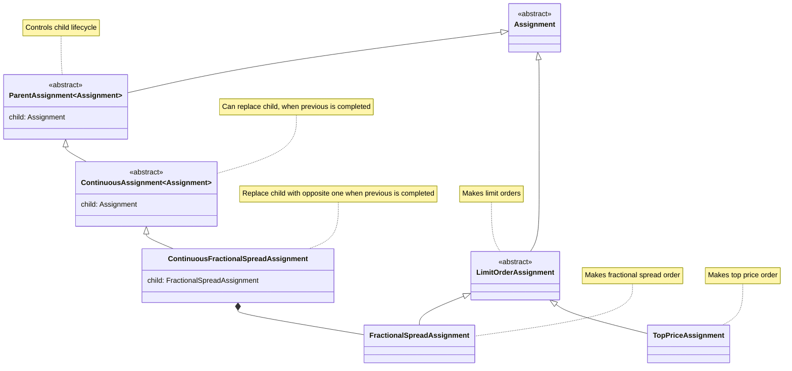

# Assignment

Assignment (поручение) - это торговая стратегия над ценными бумагами.

## Структура классов

Сами классы поручений находятся в [model](./model/core)

Все стереотипные классы в модуле являются дженериками от [Assignment](./model/core/Assignment.kt) и повторяют их
иерархию, с
возможными пропусками абстрактных классов. Например, для [TopPriceAssignment](./model/core/TopPriceAssignment.kt)
существует:

- свой контроллер [TopPriceAssignmentController](./controller/TopPriceAssignmentController.kt), который наследует от
  [BasicAssignmentController<TopPriceAssignment>](./controller/BasicAssignmentController.kt)
- свой dao для PostgreSQL [TopPriceAssignmentDao](./dao/core/postgre/TopPriceAssignmentDao.kt), который наследует от
  [PostgreAssignmentDao<TopPriceAssignment>](./dao/core/postgre/PostgreAssignmentDao.kt)
- свой builder [TopPriceAssignmentBuilder](./service/core/build/TopPriceAssignmentBuilder.kt), который наследует от
  [LimitOrderAssignmentBuilder<TopPriceAssignment>](./service/core/build/LimitOrderAssignmentBuilder.kt)

и т. д.

Все эти стереотипные классы в модуле являются дженериками от самого
[TopPriceAssignment](./model/core/TopPriceAssignment.kt), для обеспечения их взаимной консистентности. Чтобы, например
starter от одного типа [Assignment](./model/core/Assignment.kt) нельзя было использовать с Mapper-ом от другого.

Подробное описание конкретных поручений:
- [TopPriceAssignment.md](./doc/core/TopPriceAssignment.md)
- [FractionalSpreadAssignment.md](./doc/core/FractionalSpreadAssignment.md)
- [ContinuousFractionalSpreadAssignment.md](./doc/core/ContinuousFractionalSpreadAssignment.md)

## Действия над поручениями

С каждым поручением можно совершить следующие
действия:

- `build` выполняет [builder](./service/core/build) - создать объект поручения из команды
  [AssignmentStartCmd](./model/cmd/AssignmentStartCmd.kt)
- `start` выполняет [starter](./service/core/start) - инициализировать поручение
- `refresh` выполняет [refresher](./service/core/refresh) - обновить поручение. Т.е. привести его в состояние как если
  бы оно было только что создано
- `cancel` выполняет [canceller](./service/core/cancel) - отменить поручение
- `continue` выполняет [continuer](./service/core/continuation) (только для
  [ContinuousAssignment](./model/core/ContinuousAssignment.kt)) - продолжить родительское
  поручение, если дочернее завершилось

Действия, кроме `build` предполагают действия у брокера: выставление / изменение / отмену заявок или локальные действия
по подписке на разные события, меняя состояние поручения.

Для управления поручениями есть [controller](./controller)s.

## Notifications

Для автоматических `refresh` и `contunue` есть механизм периодических нотификаций. Для этого в команде задаётся период,
c помощью [TaskScheduler](../common/scheduler/TaskScheduler.kt) заводится Publisher, который шлёт периодические
[Tick](../common/scheduler/base/model/Tick.kt)-и в свои Subscribers. После этого на него подписывается соответствующий
[AssignmentNotifierSubscriber](./model/notify/AssignmentNotifierSubscriber.kt), который исполняет нужное действие
по [Tick](../common/scheduler/base/model/Tick.kt)-у

## Persistency

Все [Assignment](./model/core/Assignment.kt)s хранятся в PostgreSQL через
[AssignmentDao](./dao/core/AssignmentDao.kt). Перед действием соответствующий сервис достаёт поручение, после
завершения действия, обновляет.

Конкурентность обновления одного поручения пока не реализована из-за ненадобности, поскольку приложение развёрнутов в
1-м экземпляре.

Notifications тоже персистентны, за это отвечает [NotifyOrchestrator](./service/notify/NotifyOrchestrator.kt)
