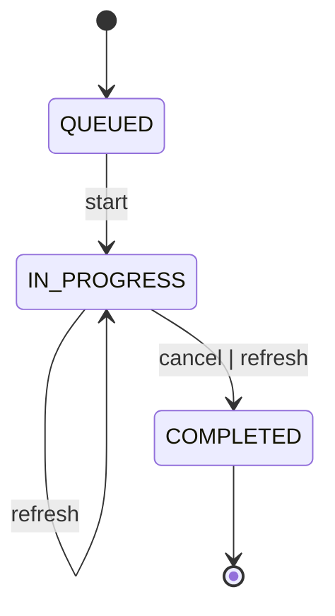

Assignment (поручение) - это торговая стратегия над ценной бумагой (instrument). Приложение принимает параметры
поручения от пользователя и реализует заложенную в поручение стратегию.

### Глоссарий

- **Заявка (order)** - заявка на совершение сделки с ценной бумагой у брокера.
- **Лимитная заявка (limit order)** - заявка на совершение сделки по конкретной цене.
- **Стакан** - биржевой стакан по ценной бумаге.
- **Шаг цены** - минимальный шаг цены в стакане. Все цены в стакане кратны шагу цены.

## Действия над поручениями

- `start`
- `cancel`
- `refresh`

Жизненный цикл поручения:

Что делает каждое действие для конкретного поручения написано в соответствующем разделе:

- [TopPriceAssignment](./TopPriceAssignment.md) - продажа 1 лота по лучшей цене
- [FractionalSpreadAssignment](./FractionalSpreadAssignment.md) - продажа 1 лота по лучшей цене с указанием минимального
  спреда
- [RepeatableFractionalSpreadAssignment](./RepeatableFractionalSpreadAssignment.md) - цикл из покупок и продаж по
  стратегии FractionalSpreadAssignment

### Start

Инициализирует новое поручение.

**Параметры:** зависят от конкретной стратегии.

**Результат:** `assignmentId` - идентификатор поручения.

### Refresh

Приводит все артефакты поручения в соответствие со стратегией. Например:

- Если стратегия предполагает расчёт цены в зависимости от текущих цен в стакане, то refresh произведёт перерасчёт
  согласно актуальным ценам и изменит актуальные заявки на покупку/продажу.
- Если цель стратегии продать 1 лот инструмента, то в при исполнении заявки refresh переведёт поручение в состояние
  `COMPLETED`.

**Параметры:**

- `assignmentId` - идентификатор поручения

### Cancel

Отменяет поручение. Все артефакты поручения тоже отменяются, после отмены поручения оно становится неизменяемым.

**Параметры:**

- `assignmentId` - идентификатор поручения

## Автообновление поручений

В start-команду можно добавить параметр `refreshNotifierProperties.period`, тогда над поручением с указанным периодом
будет совершаться refresh.

При отмене поручения его автообновление завершается.

## Вложенные поручения

Поручение может порождать другие поручения. В этом случае вложенным поручением управляет родительское поручение.