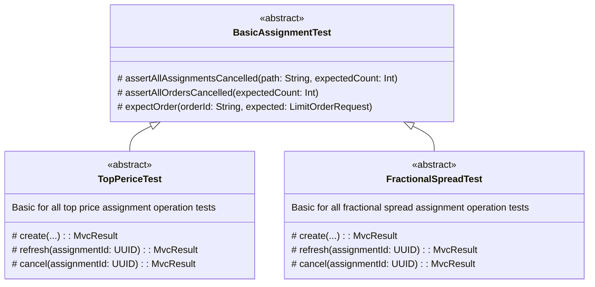

# Assignment tests

По самим Assignments см. документацию
в [main](../../../../../../../main/kotlin/ru/pashkovske/buratino/assignment/code.md).

## Структура

Тесты повторяют структуру самих Assignments.
На месте абстрактных классов могут быть только классы с вспомогательными protected методами, отвечающими за операции над
поручениями.
Все тесты наследуются от [BasicAssignmentTest](BasicAssignmentTest.kt).
1 класс для кейсов каждой проверяемой операции над поручениями:

- `create`
- `refresh`
- `cancel`
- `coninue`

